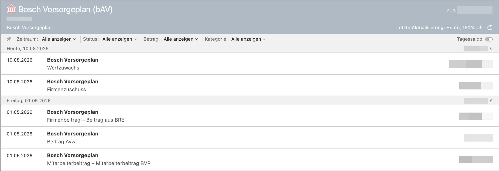

# moneymoney-ext-bosch-bav

Inofficial [MoneyMoney](https://moneymoney.app/) WebBanking extension that reads the
current value of your Bosch Vorsorgeplan / Bosch Pensionsfonds account (bAV) from
[boschvorsorgeplan.de](https://www.boschvorsorgeplan.de/) via web scraping.

Not affiliated with or endorsed by Robert Bosch GmbH or the Bosch Vorsorgeplan portal
operator. Use at your own risk — the portal can change its markup at any time, which
would break this extension.

## What it does

1. Logs into the participant portal ("Mit Zugangsdaten zum Altersversorgungskonto") with
   your username and password.
2. If your account has the app-based second factor enabled, MoneyMoney will prompt you
   for the "Bestätigungscode" shown in your authenticator app.
3. Opens the "Beitragsübersicht" page and reads the total "Kontostand" value into a
   single savings-type account in MoneyMoney.
4. For every year of contribution history offered by the portal, opens the "Monatssicht"
   (monthly view) and turns every contribution row (Firmenbeitrag, Beitrag AVWL,
   Mitarbeiterbeitrag, ...) of every month into a transaction, dated to the 1st of that
   month. All years are re-fetched on every refresh (a handful of extra requests) rather
   than relying on MoneyMoney's `since` parameter, because MoneyMoney only ever moves
   `since` forward from transactions it already knows about — if older years were skipped
   once, they'd never get backfilled later.
5. Also reads "Wertzuwachs" (investment growth) and "Firmenzuschuss" from the
   "Kapitalzusammensetzung" breakdown. Unlike contributions, these have no dated/monthly
   breakdown of their own — they're cumulative running totals (Wertzuwachs is like
   unrealized gains on a portfolio; Firmenzuschuss only appears there irregularly). The
   extension tracks the last known value of each in `LocalStorage` and books one
   transaction per refresh for the *change* since the previous refresh, labeled just
   "Wertzuwachs"/"Firmenzuschuss" — the booking date and the sign of the amount already
   make it clear whether it grew or shrank. On the very first refresh there's no prior
   value yet (treated as 0), so that refresh books the full current total as a starting
   transaction instead of it being invisible forever.
6. Uses your Bosch-Personalnummer (from "Mein Profil") as the account's Kontonummer in
   MoneyMoney, rather than a generic placeholder.
7. Downloads "Kontoauszug" and "Renteninformation" PDFs from the Postfach's
   "Kontoauszüge und Renteninformationen" category into MoneyMoney's Dokumente view, via
   the undocumented `FetchStatements` entry point (not part of the public WebBanking API
   reference, but supported by the app — confirmed by inspecting a real published
   extension that uses it the same way). Only new documents (by filename) are downloaded
   on each refresh.

The "Anmelden mit Bosch-Konto" SSO button (corporate Bosch account / Okta-style login for
active employees) is **not** supported — only the direct username/password login for the
pension account itself.

## Installation

1. Open MoneyMoney → **Hilfe → Zeige Datenbank im Finder** (**Help → Show Database in
   Finder**). This opens the app's data folder.
2. Copy `BoschVorsorgeplan.lua` into the `Extensions` subfolder there.
3. In **MoneyMoney → Einstellungen → Erweiterungen** (**Preferences → Extensions**),
   uncheck **"Digitale Signatur von Extensions überprüfen"** ("Check Digital Signature of
   Extensions"). This is required because the script isn't signed by MoneyMoney — only
   do this if you trust the script (review the source, it's short).
4. Restart MoneyMoney.
5. **Konto hinzufügen → Andere Kontoverbindung** and search for "Bosch Vorsorgeplan".
   Enter your portal username and password. If prompted, enter the confirmation code from
   your authenticator app.

## Troubleshooting

If the account stops refreshing (e.g. because Bosch changed the portal's HTML), open
**Fenster → Protokollfenster** (**Window → Protocol Window**) in MoneyMoney to see the
extension's status/error messages. From there you can save/copy the log. There's no
automatic HTTP traffic log — add `print(...)` calls to the script to inspect specific
requests/responses while debugging.

## Statements (Dokumente)

The extension also downloads the "Kontoauszug" and "Renteninformation" PDFs from the
Postfach into MoneyMoney's Dokumente view. This uses `FetchStatements`, an entry point
that is **not part of MoneyMoney's published WebBanking API** — it works today (a real
published extension uses it the same way), but it could stop working on a future
MoneyMoney release. Treat the Dokumente feature as best-effort.

## Development notes

The extension is a single file, `BoschVorsorgeplan.lua`, with no dependencies. Syntax-check
it with `luac -p BoschVorsorgeplan.lua`.

The XPath selectors were derived from local, saved copies of the portal pages (login, 2FA,
account overview, monthly view, profile, and Postfach). Those saved pages — and any debug
logs — contain real personal data (name, balance, Personalnummer, account numbers) and are
kept out of the repository via `.gitignore`. **Never commit or share them.** When adding
selectors, document the target HTML with anonymized placeholder values only.

## Contributing

See [CONTRIBUTING.md](CONTRIBUTING.md). Security issues: see [SECURITY.md](SECURITY.md).

## License

Licensed under the Apache License, Version 2.0 — see [LICENSE](LICENSE).

Not affiliated with, endorsed by, or supported by Robert Bosch GmbH or the operator of the
Bosch Vorsorgeplan portal. Structure inspired by the Trading 212 MoneyMoney extension by
Teal Bauer (also Apache-2.0).
